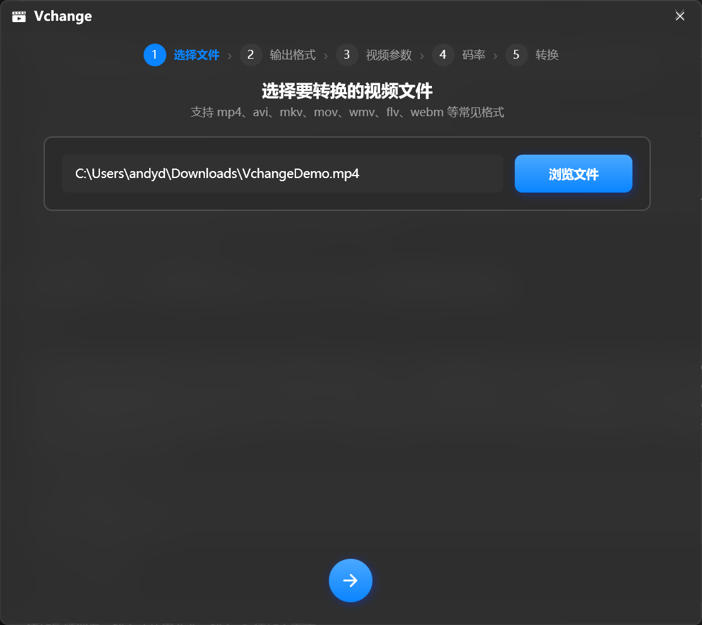
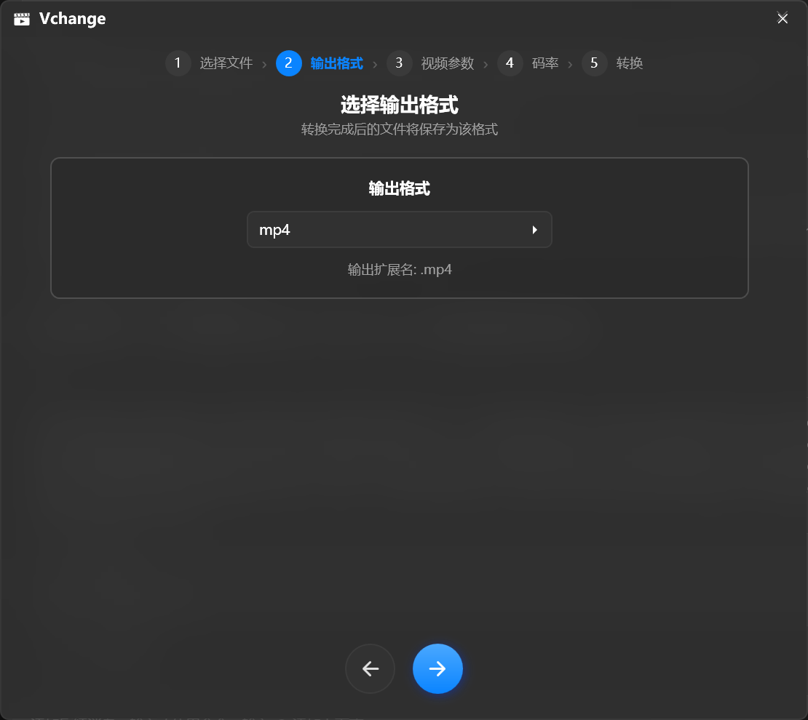
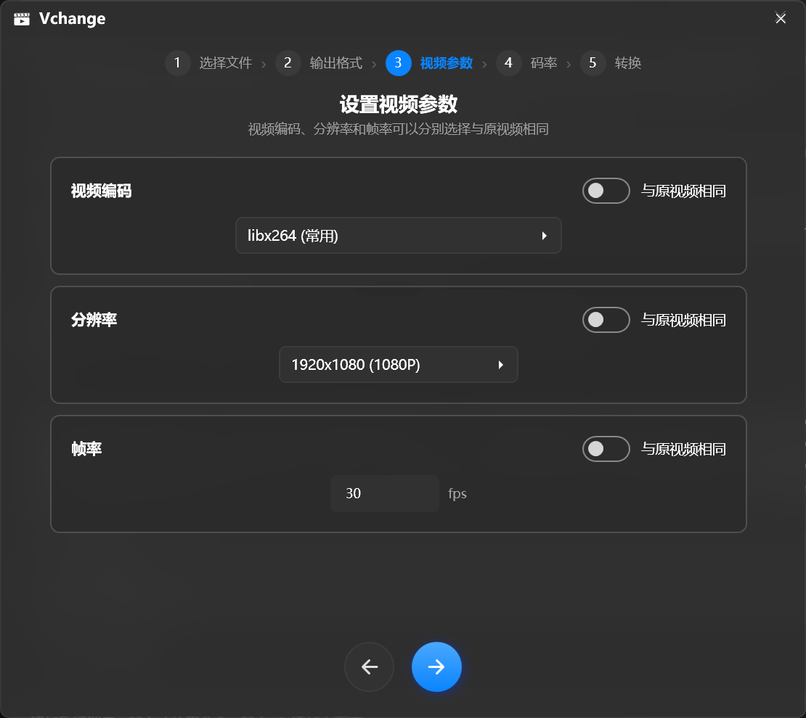
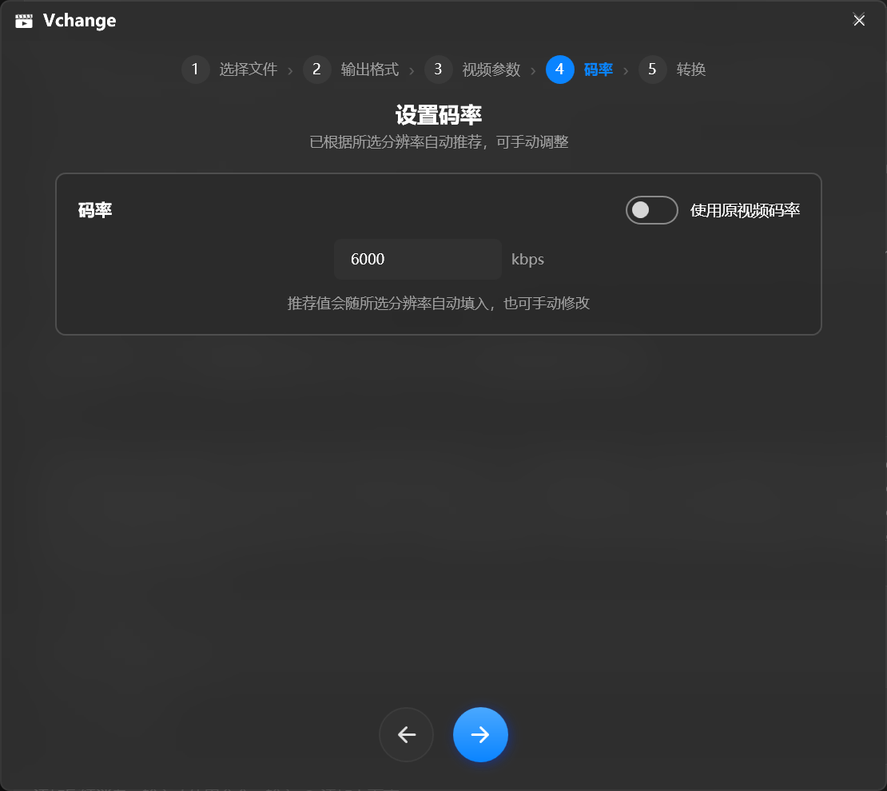
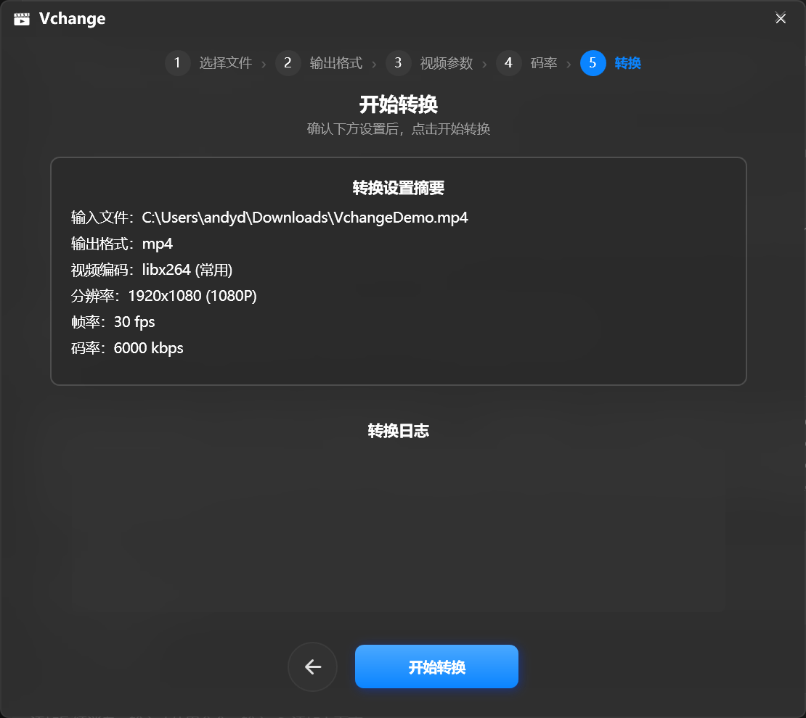
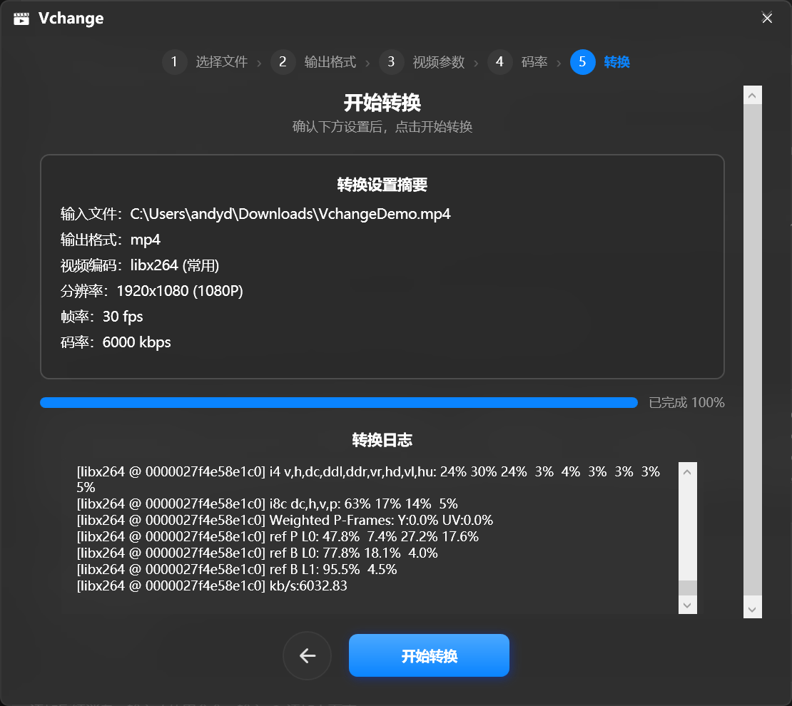

<!--markdownlint-disable MD033 MD041-->

<div align="center">

<picture>
  <source media="(prefers-color-scheme: dark)" srcset="docs/images/logo-dark-theme.png">
  
</picture>

# Vchange

**Windows 视频 / 图片转换 · 延时合成 · 图片堆砌 · WPF + ffmpeg**

视频转换、图片转换、延时合成、图片堆砌四合一，向导式操作，单文件免安装，开箱即用。

English: [**README_EN.md**](README_EN.md)

[](https://github.com/Andydot-ui/Vchange/releases/latest)
[](https://github.com/Andydot-ui/Vchange/releases)
[](https://github.com/Andydot-ui/Vchange)
[](https://github.com/Andydot-ui/Vchange)
<br/>

[](LICENSE)
[](https://github.com/Andydot-ui/Vchange/issues)

[**⬇ 立即下载**](https://github.com/Andydot-ui/Vchange/releases/latest) | [**🐛 反馈问题**](https://github.com/Andydot-ui/Vchange/issues)

</div>

## ✨ 功能

### 🏠 四合一主界面

- [x] 启动后先选择要使用的工具：**视频转换 / 延时合成 / 图片堆砌 / 图片转换**
- [x] 四个工具共用同一套引导式界面与参数逻辑，随时返回上一步修改
- [x] 流畅的渐隐渐显页面切换动画，选中卡片带强调动画

### 🎬 视频转换

- [x] 分步操作：**选择文件 → 输出格式 → 视频参数 → 码率 → 转换**
- [x] 支持 **21 种输出格式**（mp4 / mkv / avi / mov / webm / gif / apng 动图 …）
- [x] 视频编码、分辨率、帧率可**分别选择与原视频相同**
- [x] 码率根据分辨率**自动推荐**，也可手动调整；分辨率支持常见预设与自定义（宽 × 高）
- [x] 硬件加速编码：`h264_nvenc` / `h264_qsv` / `h264_amf` / HEVC / AV1
- [x] **批量转换**：浏览框可多选文件，多文件时选择输出文件夹逐个转换，进度显示 `i/N`、日志逐条记录，同名输出自动加序号
- [x] **色彩空间**选项按 **SDR / HDR** 分组：BT.709、BT.601、BT.2020、HDR10（PQ，10-bit，写入 ST 2086 静态元数据）、HLG（10-bit），也可保持与原视频相同

### ⏱ 延时合成

- [x] 将延时摄影的图片序列**自动按补零文件名重命名**（01、02、03 …，补零位数随文件数自适应）
- [x] 两种方案：**复制到 `rename` 新文件夹** / **就地重命名**；磁盘空间不足时自动切换到就地方案并锁定提示
- [x] 重命名与视频合成**两条进度条一上一下**，先重命名后合成
- [x] 合成参数与视频转换完全一致（帧率 / 格式 / 编码 / 码率推荐 / 分辨率可选原图）
- [x] 合成完成后**调用默认播放器播放**，确认无误后自动清理 `rename` 文件夹

### 🌌 图片堆砌

- [x] 星轨、流水、车流等**长曝光堆砌**：最大值 / 平均值 / 最小值三种合成方式
- [x] 输出 **JPG / PNG / BMP / TIFF / DNG**（16-bit 线性 DNG，纯 C# 写入）
- [x] JPEG 品质滑杆、输出分辨率可选（与原图相同 / 标准预设 / 自定义）
- [x] 全程堆砌进度条 + 堆砌日志
- [x] 输出为**不含 EXIF 元数据**的纯净图片

### 🖼 图片转换

- [x] 图片格式互转（支持多选**批量转换**）：**JPG / PNG / BMP / TIFF / WEBP / WMP / DNG**
- [x] 批量时选择输出文件夹逐个转换，进度显示 `i/N`，同名输出自动加序号
- [x] 可调选项：JPG / WebP 品质滑杆、TIFF 压缩算法（LZW / 无 / Zip / RLE / CCITT G4）、PNG 交错、输出分辨率
- [x] **输出色彩空间**按 **SDR / HDR** 分组：sRGB、Adobe RGB、Display P3、ProPhoto RGB、ACEScg、HDR10（PQ）、HLG；广色域与 HDR 自动以 **16-bit PNG** 输出
- [x] 默认「与原图一致」，不改变像素值
- [x] 动图（GIF / APNG）的转换归入视频转换

### 🎨 现代化的界面

- [x] 深色 / 浅色主题**跟随系统自动切换**
- [x] Windows 11 亚克力（Acrylic）毛玻璃窗口
- [x] 自绘无边框窗口、圆角卡片、拨动开关、美化后的品质滑杆
- [x] 实时进度条（百分比 + 速度）与 ffmpeg 原始日志
- [x] 记住窗口位置，下次在原位打开

### 📦 开箱即用

- [x] **单文件 exe**，免安装 .NET 运行时（内嵌 .NET 8）
- [x] **内嵌完整版 ffmpeg 9.0.2**，无需单独下载
- [x] 应用图标随系统深浅色自动切换（白 / 黑场记板）

## 📷 界面截图

> 以下为**视频转换**流程截图；延时合成、图片堆砌与图片转换采用同样的向导式界面。

### 主流程

##### 1. 选择视频文件



##### 2. 选择输出格式



##### 3. 设置视频参数



##### 4. 设置码率



##### 5. 转换设置摘要



##### 6. 转换完成（进度与日志）



## 🚀 开始使用

**系统要求**：Windows 10 / 11（64 位）

1. 打开 [**Releases 页面**](https://github.com/Andydot-ui/Vchange/releases/latest)
2. 下载并运行 `Vchange.exe`
3. 在首页选择要使用的工具，按向导完成操作即可

> [!TIP]
> GitHub 下载速度慢？可使用高速镜像：[**123 云盘 · Vchange.exe**](https://1828395166.share.123pan.cn/123pan/DA7Sjv-BaZvv)
>
> [!IMPORTANT]
> **高速链接仅对最新版本有效**：每次发布新版本后，旧版本的高速下载链接会失效。请始终以本 README 与[项目官网](https://andydot-ui.github.io/Vchange/)中的最新链接为准，历史版本请从 [Releases](https://github.com/Andydot-ui/Vchange/releases) 页面下载。

> [!NOTE]
> 首次使用时会自动释放内嵌的 ffmpeg（约需几秒），之后复用不再重复释放。
> 无需安装 .NET 运行时，也无需单独配置 ffmpeg。

### 下载文件说明

| 文件 | 用途 |
| --- | --- |
| `Vchange.exe`（约 372 MB） | **主程序**（推荐）——单文件绿色版，内置 .NET 8 运行时与完整版 ffmpeg，下载后双击直接用 |
| `ffmpeg-9.0.2-full.exe`（约 217 MB） | 完整版 ffmpeg 命令行工具，普通用户无需下载；适合需要单独使用 ffmpeg 或替换内嵌版本的进阶用户 |

## 🔧 从源码构建

1. 安装 Visual Studio 2022 / .NET 8 SDK
2. 将完整版 `ffmpeg.exe` 放入 `Resources\` 目录（仅 Release 打包时内嵌）
3. 执行：

```bash
dotnet publish Vchange.csproj -c Release -r win-x64 --self-contained true \
  -p:PublishSingleFile=true -p:IncludeNativeLibrariesForSelfExtract=true \
  -p:EnableCompressionInSingleFile=true
```

4. 产物位于 `bin\Release\net8.0-windows\win-x64\publish\Vchange.exe`

> 仓库根目录下若存在嵌套的旧 `Vchange\` 副本目录，已在 `Vchange.csproj` 中排除，不会参与编译。

## 📁 项目结构

```
Vchange/
├─ Vchange.csproj                 # 项目文件（.NET 8.0-windows + WPF）
├─ App.xaml / App.xaml.cs         # 应用入口与全局样式（主题资源）
├─ MainWindow.xaml / .xaml.cs     # 主界面与业务逻辑（四套流程 + 主页）
├─ MessageDialog.xaml / .xaml.cs  # 自定义提示对话框（含确认模式）
├─ FfmpegProvider.cs              # ffmpeg 定位（外部 / PATH / 内嵌释放）
├─ ThemeManager.cs                # 深浅色主题管理与切换
├─ RenameEngine.cs                # 图片序列自然排序、补零重命名、磁盘检查
├─ TimelapseFlow.cs               # 延时合成流程（重命名 + 合成）
├─ ImageStacker.cs                # 长曝光堆砌引擎（最大值 / 平均 / 最小值）
├─ StackingFlow.cs                # 图片堆砌流程
├─ ImageConverter.cs              # 图片格式转换与色彩空间重映射引擎
├─ ImageConvertFlow.cs            # 图片转换流程
├─ TiffWriter.cs                  # TIFF 编码器（纯 C#）
├─ DngWriter.cs                   # 16-bit 线性 DNG 写入器（不含 EXIF）
├─ Vchange.slnx                   # 解决方案文件
├─ Resources/
│   ├─ app_white.ico              # 深色主题图标
│   └─ app_dark.ico               # 浅色主题图标
├─ tools/
│   ├─ make-icon.ps1              # 应用图标生成脚本
│   └─ take-screenshots.ps1       # 界面截图自动化脚本
└─ docs/                          # 官网（GitHub Pages）与截图资源
   ├─ index.html                  # 官网页面（Apple 风格，纯静态）
   └─ screenshots/                # 界面截图
```

## ❓ 常见问题

<details>
<summary><b>v1.2.0 新增了什么？</b></summary>

**视频转换与图片转换全面支持批量**：多选文件 → 选输出文件夹 → 逐个转换（`i/N` 进度、逐条日志、同名自动加序号）。同时修复延时合成 / 图片堆砌在**纯 DNG 文件夹**上误报「没有找到图片文件」（现已识别 `.dng` / `.wdp` / `.jxr`），保存对话框默认打开源文件夹。
</details>

<details>
<summary><b>首次运行提示「无法验证发布者」怎么办？</b></summary>

正常现象：程序未购买商业代码签名证书，Windows 对未知发布者会要求确认，**并非病毒误报**。蓝色框点「更多信息 → 仍要运行」，灰色框点「运行」即可。若遇到无法创建解包目录而闪退，把 exe 移到**英文路径**（如下载文件夹）再运行。
</details>

<details>
<summary><b>转换失败怎么办？</b></summary>

查看「转换日志」中 ffmpeg 的原始输出，通常会明确指出失败原因（如源文件损坏、编码器不支持等）。
</details>

<details>
<summary><b>为什么第一次转换会慢一点？</b></summary>

首次转换需要把内嵌的 ffmpeg 释放到 `%LocalAppData%\Vchange\ffmpeg.exe`（约 217MB），只需一次，之后立即可用。
</details>

<details>
<summary><b>支持硬件加速吗？</b></summary>

支持。视频编码下拉框中可选择 `h264_nvenc`（N 卡）、`h264_qsv`（Intel 核显）、`h264_amf`（A 卡）等硬件编码器。
</details>

<details>
<summary><b>堆砌 / 转换会写入 EXIF 信息吗？</b></summary>

不会。堆砌与图片转换输出**不含 EXIF 元数据**的纯净图片（16-bit 线性 DNG 同样不含 EXIF），拍摄信息请以原图为准。
</details>

<details>
<summary><b>高速下载链接打不开 / 下载的不是最新版？</b></summary>

123 云盘高速链接**只对最新版本有效**，发布新版本后旧链接会失效。请回本 README 或[项目官网](https://andydot-ui.github.io/Vchange/)复制最新链接，或直接从 [Releases](https://github.com/Andydot-ui/Vchange/releases) 下载。
</details>

## 🙋 反馈与支持

遇到问题或有新想法？欢迎反馈（提交时请按模板填写，信息越完整解决越快）：

- [🐛 提交 Bug 反馈](https://github.com/Andydot-ui/Vchange/issues/new?template=BugReport.yml)
- [💡 提交功能建议](https://github.com/Andydot-ui/Vchange/issues/new?template=FeatureRequest.yml)
- [📋 查看已有 Issues](https://github.com/Andydot-ui/Vchange/issues)
- 📮 邮箱联系：**andydot@qq.com**

## ⭐ Star History

<a href="https://www.star-history.com/?repos=andydot-ui%2Fvchange&type=date&releases=&legend=bottom-right">
 <picture>
   <source media="(prefers-color-scheme: dark)" srcset="https://api.star-history.com/chart?repos=andydot-ui/vchange&type=date&theme=dark&legend=bottom-right" />
   <source media="(prefers-color-scheme: light)" srcset="https://api.star-history.com/chart?repos=andydot-ui/vchange&type=date&legend=bottom-right" />
   
 </picture>
</a>

## 📄 许可证

本项目基于 [GNU General Public License v3.0（GPL-3.0）](LICENSE) 开源。

<div align="center">

如果这个项目对你有帮助，欢迎点一个 ⭐ Star！

</div>
